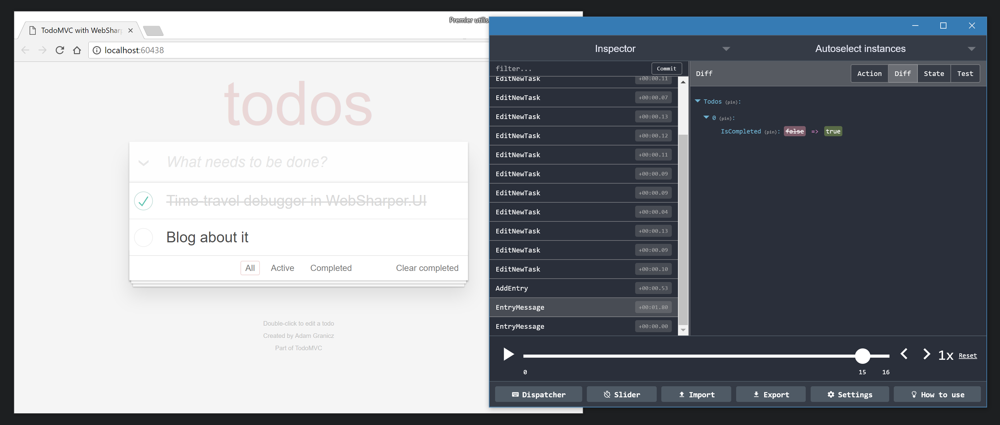

# RemoteDev integration

WebSharper.Mvu integrates seamlessly with [RemoteDev](https://github.com/zalmoxisus/remotedev). This tool allows you to inspect the successive messages and states of your model, and even to replay old states and see the effect on your view.



## Installing and starting the tool

RemoteDev can be used in multiple ways, documented on [its website](https://github.com/zalmoxisus/remotedev). We recommend the following setup:

* Start the remotedev server:

    ```bash
    $ npm install -g remotedev-server     # Run once to install the server
    $ remotedev                           # Start the remotedev server
    ```

* Install and start the [Redux devtools extension](https://github.com/zalmoxisus/redux-devtools-extension#installation) for your browser.

Note that at the time of writing, `remotedev-server` is compatible with nodejs 6.x, but not 8.x.

## Code integration

RemoteDev integration is applied using a single call to `App.WithRemoteDev`, which takes RemoteDev options as argument. Here is an example with options appropriate for use with `remotedev-server`:

```fsharp
let Main() =
    App.Create initialModel update render
    |> App.WithRemoteDev (RemoteDev.Options(hostname = "localhost", port = 8000))
    |> App.Run
```

This integration uses WebSharper.Json serialization to communicate with RemoteDev. The tool expects message values to be objects with a `"type"` field; therefore, you should use as Message type a discriminated union annotated like follows:

```fsharp
[<NamedUnionCases "type">]
type Message =
    | Message1 of id: int * value: string
    | // other message types...
```

Given the above, the value:

```fsharp
Message1 (42, "Hello world!")
```

will be sent to RemoteDev as:

```json
{ "type": "Message1", "id": 42, "value": "Hello world!" }
```
